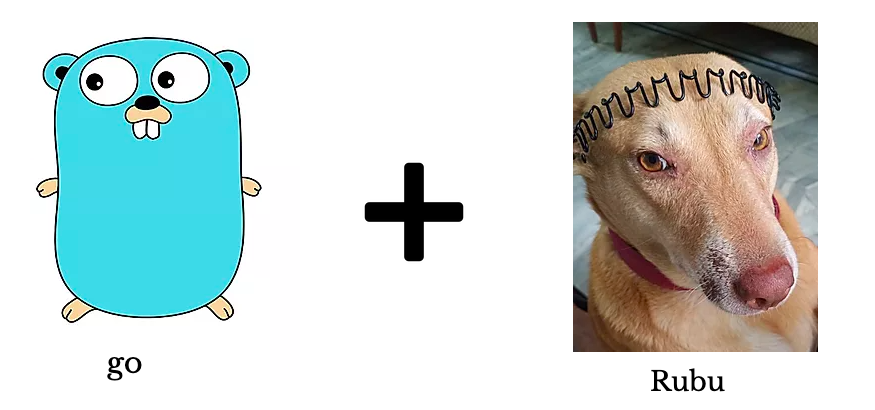
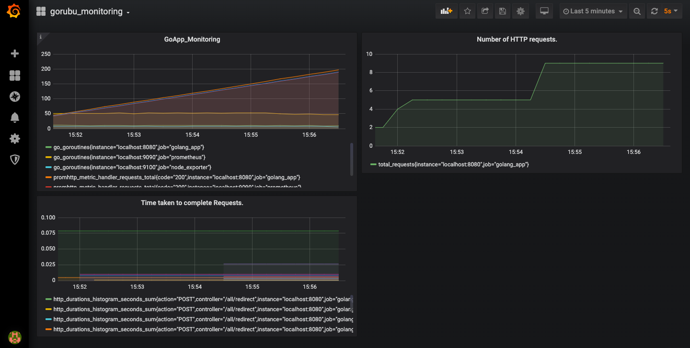
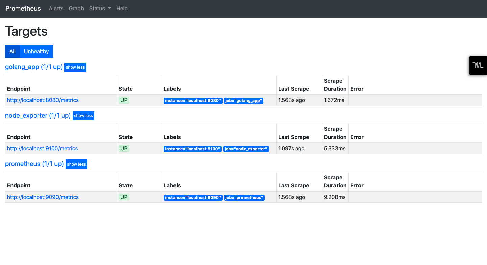

# goRubu

 

This repo contains implementation of a Url Shortner written in [Go](https://golang.org/).

[](https://travis-ci.org/rv404674/goRubu)
[](https://coveralls.io/github/rv404674/goRubu?branch=master)
[](https://goreportcard.com/report/github.com/rv404674/goRubu)

## What is goRubu? 🚀

1. A Url Shortner written in Go , with a Mongo based backend.
2. Supports Caching for Hot urls, with Memcached, using a LRU based eviction
strategy, and write through type of caching mechanism. Saw 50% decrease in
Read Latency for URL redirection, after caching.
3. Used Travis CI to add CI/CD pipeline and dockerized the whole application, so
that it can be easily deployed and can be scaled up/down depending on the load.
4. Prometheus and Grafana based monitoring, to get an overall picture of the
system and application metrics.
5. Contains Api Validation and Logging Middlewares, along with Swagger based documentation

Monitoring:

 
 
##  Why goRubu? 🧐

Wanted to Learn Go and system design by building a project. Hence goRubu.

## Prerequisites ✅

Ensure you have the following installed.
**[Mongodb](https://docs.mongodb.com/manual/)** 
**[Memcached](https://www.memcached.org/)**
**[Make](https://tutorialedge.net/golang/makefiles-for-go-developers/)**

On Macos, simply use thse
```bash
$ brew update
$ brew install mongodb/brew/mongodb-community
$ brew install memcached
$ brew install make
```

> **Note**: After that check whether these have been started, else you will get connection error.
```bash
$ brew services list
```

if any service is not up do
```bash
$ brew service start service_name
```

Then we need to download the tar files for prometheus, grafana and node exporter.
We will need to edit their config files, hence we are not using brew install for these. Also it becomes easy to run the server and do changes.

**For Grafana**
```bash
wget https://dl.grafana.com/oss/release/grafana-6.7.3.darwin-amd64.tar.gz
tar -zxvf grafana-6.7.3.darwin-amd64.tar.gz
mv grafana-6.7.3 /usr/local/bin
cd /usr/local/bin/grafana-6.7.3/bin
./grafana-server # this will run the grafana server
```

**Note** - By default prometheus server runs on 9090, and grafana on 3000.

Similarly download tar files for prometheus and node exporter and run there servers as well.

 ## Usage ⚙️
1. Go to the dir where prometheus is installed and change the prometheus default .yml file to this one [new_yml](prometheus.yml), run the prometheus server, and node_exporter server.

2. do 
```bash 
$git clone https://github.com/rv404674/goRubu.git
```
3. cd in goRubu, and do
```bash
make deps
```
It will install all the go dependencies.

4. Then do 
```bash
make setup
make install
make execute
```
> **Note**: To see what these commands do check out this [makefile](Makefile)

5. Hit **http://localhost:8080/all/shorten_url** with any url as key.
```json
{
	"Url": "https://www.redditgifts.com/exchanges/manage"
}
```

The endpoint will return a shortened URL.

6. Hit **http://localhost:8080/all/redirect** with the shortened url to get the original URL back.
```json
{
	"Url": "https://goRubu/MTAxMTA="
}
```

5. Hit **http://localhost:9090/targets** (its where prometheus server will be running).
If everything is working fine, The UI should look something like this
 

# Contributing 🍻

Peformance Improvements, bug fixes, better design approaches are welcome. Please Discuss your change by raising an issue, beforehand.

# Maintainer 😎

[Rahul Verma](https://www.linkedin.com/in/rahul-verma-8aa59b116/)
[Email](rv404674@gmail.com)

## License

[MIT](LICENSE) © Rahul Verma